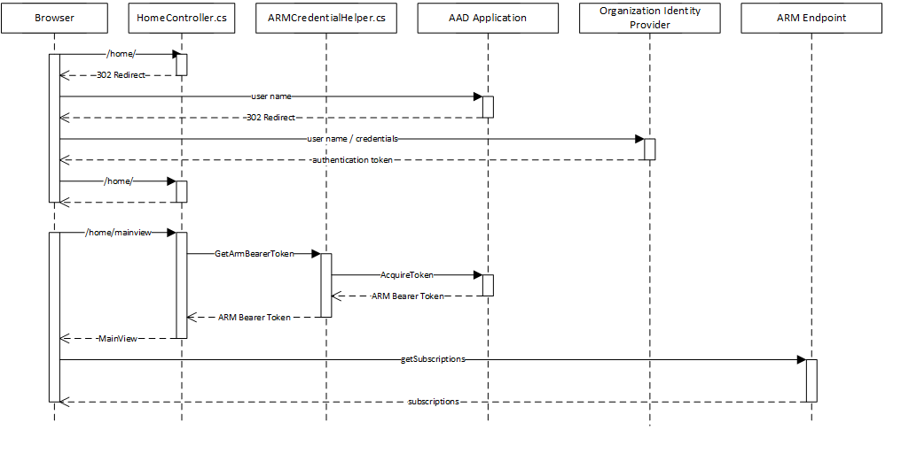
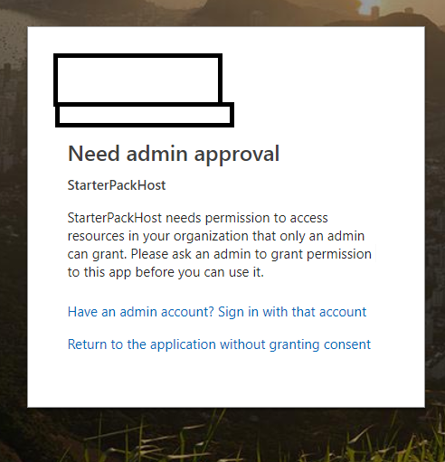

# Integrate
Packaged output from the StarterPackSample project (index.html and associated JavaScript) can be integrated with Azure portal extensions or externally hosted solutions.  Code samples in StarterPackFrameBlade and StarterPackHost repsectively provide key resources to perform either integration.

## Portal Integration
StarterPackFrameBlade contains a sample Azure portal blade (FrameBlade.ts) demonstrating how to surface StarterPackSample in the Azure portal.  FrameBlade.ts must be copied into the target extension's client code with a number of minor subsequent modifications:

1. Import a reference to the host extension's Data Context type.
2. Replace 'ExtensionDataContextType' (line 8) with the name of the imported data context type.
3. Copy the StarterPackSample `dist` folder and contents to a location within the extension project.
4. Populate the relative path to index.html (line 15) as the parameter to ...getVersionlessContentUri('')

Step three ensures the build outputs are available at runtime.  The step can be automated with a additional script in project.json under StarterPackSample.  For example:
```
"copy-build-portal":
    "IF EXIST {destinationForDistFolder}\\dist RMDIR /Q /S {destinationForDistFolder}\\ && 
    XCOPY .\\build\\dist {destinationForDistFolder}\\dist /S"
```
Following these steps, execute a normal debugging session to view the newly added FrameBlade and its member IFRAME.  

### FrameBlade.ts Anatomy
Examination of the FrameBlade code reveals the message communication harness utilized to pass state and configuration between the extension and StarterPackSample.  The blade handles three messaging scenarios:

1. The hosted IFRAME sends a 'ready' message to the blade.  The IFRAME must send this message for the host blade to reveal IFRAME content to users.  Orchestrating code resides in the base type of the blade.  

2. The hosted IFrame requests a configuration setting from the portal.  Method _registerMessageHandlers specifies message types (defined by message payload's 'kind' property) handled by the blade and requisite responses.  Notably, responses may be wrapped in a promise when information must be fetched asynchronously.  The 'authorizationToken' event handler provides an example.


3. The host blade must inform the hosted IFrame of a change in configuration.  Method _registerEvents registers these 'push' style notifications.  Push notification scenarios arise when a portal setting changes without mandating a blade or window refresh (e.g. themes).

The Azure Portal FrameBlade brokers messages using window.postMessage.  The message payload adheres to the following schema: 
```
{
    data: {
        requestId: {}  //UUID of request sent by hosted IFrame (when applicable)
        responseBody: {} //hosts serialized data for IFrame
    };
    kind: string;  //denotes the type of information in responseBody (e.g. languageCode)
    signature: string; //denotes shared identifier between host and Iframe.
}
```

For event (e.g. push to IFrame) scenarios, `requestId` and `kind` properties share the same value.

## External Host Integration
StarterPackHost supplies a .NET Core 2.x web application able to render the build output of StarterPackSample.  The solution surfaces StarterPackSample's index.html file in an IFrame view available at ./home/MainView when running the application.  The application does require some preconfiguration before use.  

* `Copy StartPackSample dist contents to a location within the project.`  Specifically, index.html and associated JavaScript files must reside under `\wwwroot\js\frame.`  An additional NPM script may be useful here:
```
"copy-build-host":
    IF EXIST ..\\StarterPackHost\\StarterPackHost\\wwwroot\\js\\frame 
    RMDIR /Q /S ..\\StarterPackHost\\StarterPackHost\\wwwroot\\js\\frame\\ && 
    XCOPY .\\build\\dist ..\\StarterPackHost\\StarterPackHost\\wwwroot\\js\\frame\\ /S
```

* `Configure Azure Active Directory Authentication`  The application relies on a multi-tenant Azure Active Directory (AAD) application to authenticate users and retrieve authorization tokens for Azure Resource Management (ARM) service calls.  The following steps describe how to create the application.

    1. Open the Azure Portal (portal.azure.com) in a browser
    2. Click `Azure Active Directory`
    3. Click `App Registrations`
    4. Click `New application registration`
    5. Specify the name of the application registration ('hostApp' for these instructions)
    6. Enter https://localhost:44330/ as the SignOn Url.
    7. Click `Save`
    8. From the app's properties (reached via `App Registrations` view), click on `Settings`
    9. Click `Properties`
    10. Toggle `Multi-tenanted` to Yes
    11. Click `Save`
    12. Click `Reply URLs`
    13. Add entry: `https://localhost:44330/signin-oidc`
    14. Click `Save`
    15. Click `Required Permissions`
    16. Click `Add`
    17. Click `Select API`
    18. Click `Windows Azure Service Management API`
    19. Click `Select`
    20. Click `Access Azure Service Management as organization users (preview)`
    21. Click `Select`
    22. Click `Done`
    23. Click `Grant Permissions`
    24. Click `Yes` in dialog
    25. Click `Keys`
    26. Add entry under `Passwords` -- recording the generated key.
    27. Retain the key for future use.
    28. Open `appSettings.json` of the StarterPackFrameHost
    29. Populate `ClientSecret` with the generated key.
    30. Populate `ClientId` with the Application ID guid found (located when viewing the AAD app details)
    31. Save and close file.
    
The solution can now be debugged locally.  Navigate to https://localhost:44330/home/mainview to see the StartPackSample view.

### Solution Anatomy
The StarterPackHost customizes the standard .NET Core 2.x template with the following additions:

1. Provides MainView intended to surface StarterPackSamples content in an IFrame.  `MainView.cshtml` demonstrates IFrame messaging, enabling the application to pass configuration and authorization information to StarterPackSamples.

2. Provides `AzureResourceManagementCredentialHelper.cs` responsible for obtaining an Azure Resource Management (ARM) authorization token.  Method `GetArmBearerToken` generates a token from the initial auth token acquired when the user logs into the application.  The following sequence diagram outlines the complete authentication/authorization flow:



Notably, the application must retain the originally issued auth token to generate the derived bearer token.  AzureAdAuthenticationBuilderExtension contains the necessary modification, specifying 
```
options.TokenValidationParameters = new TokenValidationParameters
{
    // Instead of using the default validation (validating against a single issuer value, as we do in line of business apps),
    // we inject our own multitenant validation logic
    ValidateIssuer = false,

    // Save Sign In Toke for ARM Bearer Token Generation
    SaveSigninToken = true
    // If the app is meant to be accessed by entire organizations, add your issuer validation logic here.
    //IssuerValidator = (issuer, securityToken, validationParameters) => {
    //    if (myIssuerValidationLogic(issuer)) return issuer;
    //}
};
```

### Limitations
StarterPackHost is a sample application and therefore does not:
1. Address ARM bearer token timeout and refresh scenarios.
2. Address how to directly integrate StarterPackSamples into application without IFrames. 
3. Endorse or recommend any security practices.

Consumers are subsequently responsible for reviewing their security posture and how to best secure token information.

When authenticating against a production identity provider, consumers will likely encounter a message specifying they must grant their application permission to access resources (e.g. generate ARM tokens) 



Consumers must coordinate the owners of the identify provider to grant necessary access.


